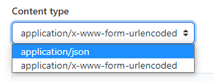

# How to use
1. Go to your [webhook dashboard](https://github.com/sponsors/NexInfinite/dashboard/webhooks)
2. Click on `add a webhook`  
3. Change the `payload url` to [this domain](#get-a-webhook)  
4. Change the Content type to `application/json`  

# Get a webhook
To get your domain, open up discord and go to the channel you want your webhook to be sent to and go to `settings > Integrations > Webhooks` and click `new webhook`.
Customize this as much as you want and then hit `Copy Webhook URL`. 
This should look something like this `https://discord.com/api/webhooks/WEBHOOK_ID/WEBHOOK_AUTH`.
In the example domain I've used `WEBHOOK_ID` and `WEBHOOK_AUTH`. 
Copy these from your discord webhook and place them in this domain `https://julians.work/webhook?webhook_id=WEBHOOK_ID&webhook_auth=WEBHOOK_AUTH`. 
Congratulations, you now have a webhook that will work for discord. 
You can also add a variable `color` to the domain to get a custom colour on your embed. 

Your embed will look like this but the icon and title will change for the price of and user who supported you. 
`Foo` will also change to the description of your package. __More customizations coming soon__. 

# Please note
~~This is an idea and is a wip. Please check back to see progress or join my discord server to be announced when this goes live [here](https://julians.work/cum)~~
